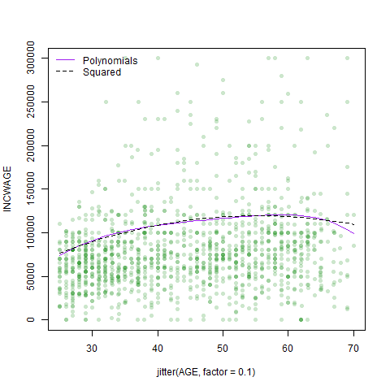
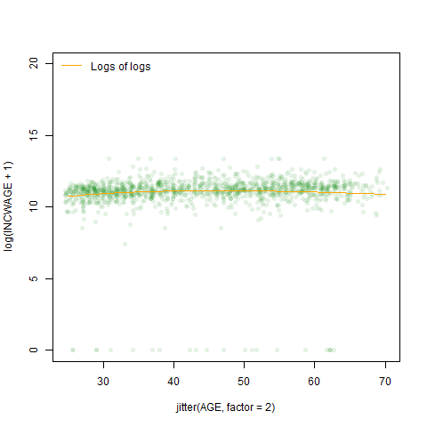

```{r include=FALSE}
knitr::opts_chunk$set(echo = FALSE)
library(stargazer)
library(dplyr)
load("acs2017_ny_data.RData")
```
```{r}
attach(acs2017_ny)
healthcare <- (IND == "7970" | IND == "7980" | IND == "7990" | IND == "8070" | IND == "8080" | IND == "8090" | IND == "8170" | IND == "8180" | IND == "8190" | IND == "8270")
use_varb <- (AGE >= 25) & (AGE <= 70) & (LABFORCE == 2) & (WKSWORK2 > 4) & (UHRSWORK >= 35) & (female == 1) & ((educ_college == 1) | (educ_advdeg == 1)) & healthcare
dat_meda <- subset(acs2017_ny, use_varb)
dat_med <- subset(dat_meda, select = -(veteran))
detach()
```
```{r include=FALSE}
library(AER)
```
For our subset, we decided to examine how different variables impact wages for people who identify as female working in the various aspects of the medical industry. We did this by creating an object that houses different industry codes pertaining to the medical field, including physician and dentist offices, hospitals, nursing facilities and other health-care practitioners.
```{r eval=FALSE}
# creating different objects for work departure time
# want to create different objects within industry to subset office workers, hospitals, nursing facilities etc
attach(dat_med)
DEPARTS
length(DEPARTS)
graveyard <- ((DEPARTS >= 0) & (DEPARTS <= 459))
morning <- ((DEPARTS >= 500) & (DEPARTS <=930))
daytime <- ((DEPARTS >= 931) & (DEPARTS <=1700))
evening <- ((DEPARTS >= 1701) & (DEPARTS <=2359))
summary(graveyard)
summary(morning)
summary(daytime)
summary(evening)
table(morning)
deptime <- factor((1*evening + 2*morning + 3*daytime + 4*graveyard), levels = c(1, 2, 3, 4), labels = c( "Night", "Grave", "Morn", "Mid"))
table(deptime)
sum(morning+daytime)
detach()
```
For our initial regression, we elected to use the [INCWAGE](https://cps.ipums.org/cps-action/variables/INCWAGE#description_section) observations as our measure of wage. We made this decision as we believe it is reasonable to assume that most of the data observations in our subset (females in the medical field with a Bachelor or Advanced degree) would only hold one job. INCWAGE is 'the total pre-tax and salary income' each of the respondent's earned as an employee in the previous 12 months prior to the survey.

```{r}
attach(dat_med)
lma <- lm((INCWAGE ~ AGE + I(AGE^2) + educ_college))
# summary(lma)
# lmdep <- lm((INCWAGE ~ AGE + I(AGE^2) + educ_college + deptime))
# summary(lmdep)
suppressWarnings(stargazer(lma, type = "text"))
# par(mfrow = c(2, 2))
# plot(lma)
detach()
```
The regressor coefficients from the initial regression all appear to be statistically significant, the only exception being the intercept coefficient. What is curious is that holding a Bachelor's degree has a *negative* correlation with wages within the subset, as does $Age^2$. However, for our observations this makes sense; we limited our observations to people who hold Bachelor's or Advanced degrees. From an outsider's perspective of the industry, those whole hold advanced degrees or extra certifications within the medical field would be those who have specialized in particular fields, commanding higher wages for their specialized knowledge. A Bachelor's degree is closer to an entry level requirement in the field, so the comparative wages are significantly lower.

From this regression, we created our prediction model using 50% of the 2626 observations in our subset in order to give the model a sizable enough sample from which to draw its comparisons. For easy visualization, the jitter has been set to 0.1, to demonstrate the trends at different ages and the range of the INCWAGE axis has been capped at 300,000.

To draw some comparison from the linear regression, we set the prediction model to predict wages for those with advanced degrees.  
```{r}
attach(dat_med)
NNobs <- length(INCWAGE)
set.seed(12345)
graph_obs <- (runif(NNobs) < 0.5)
med_graph <-subset(dat_med, graph_obs)
detach()
```
```{r include = FALSE}
png(filename="initlmplot.png")
plot(INCWAGE ~ jitter(AGE, factor = 0.1), pch = 16, col = rgb(0, 0.5, 0, alpha = 0.2), ylim = c(0,300000), data = med_graph)
medpredict <- data.frame(AGE = 25:70, female = 1, educ_college = 1, educ_advdeg = 1)
medpredictb <- data.frame(AGE = 25:70, female = 1, educ_college = 0, educ_advdeg = 1)
medpredictb$yhat <- predict(lma, newdata = medpredictb)
lines(yhat ~ AGE, data = medpredictb)
dev.off()
initmax <- max(medpredictb$yhat)
```


The plot for the predicted values shows us a gently sloped concave curve that has a peak predicted value of `r format(round(initmax, digits = 2), scientific=FALSE)`.

When we added high polynomials, $Age^3$, $Age^4$ and $Age^5$, to the regression, the absolute values of the corresponding coefficients get progressively smaller.
```{r}
attach(dat_med)
lmpolys <- lm((INCWAGE ~ AGE + I(AGE^2) + I(AGE^3) + I(AGE^4) + I(AGE^5) + educ_college))
suppressWarnings(stargazer(lmpolys, type = "text"))
```
```{r include=FALSE}
png(filename="~/CCNY/Econometrics/Homework/Draft Hwk Files/Homework-5/Hwk-5/polyplot.png")
plot(INCWAGE ~ jitter(AGE, factor = 0.1), pch = 16, col = rgb(0, 0.5, 0, alpha = 0.2), ylim = c(0,300000), data = med_graph)
medpredictb$yhatpolys <- predict(lmpolys, newdata = medpredictb)
lines(yhatpolys ~ AGE, data = medpredictb, col = "Purple" )
lines(yhat ~ AGE, data = medpredictb, lty = 2)
legend("topleft", c("Polynomials", "Squared"), col = c("Purple", "Black"), lty = c(1,2), bty = "n")
dev.off()
```
```{r}
polymax <- max(medpredictb$yhatpolys)
```


When plotted, the curves follow a similar slope and shape. Adding the extra polynomials increases the maximum predicted wage slightly to `r format(round(polymax, digits = 2), scientific=FALSE)` but we notice a steepening of the "Polynomials" curve as age approaches 70. Running a joint hypothesis shows us that the higher-order polynomial terms are not significant; i.e. they have next to relationship with how wages are determined within the dataset.

```{r incldue=FALSE}
polyrange <- sum(max(medpredictb$yhatpolys)-min(medpredictb$yhatpolys))
initialrange <- sum(max(medpredictb$yhat)-min(medpredictb$yhat))
```
```{r}
linearHypothesis(lmpolys, "I(AGE^3) + I(AGE^4) + I(AGE^5) = 0", test="F")
```

In both regression, wages as a function of age trend upwards. Wage peaks at the age of 55 in the initial regression model but peaks later, at 59, in the polynomial model. The range of predicted wages is larger in the polynomial model by `r round(sum(polyrange-initialrange), digits=2)`

If we use $log(Age)$ in our regression instead, we can clearly see that the log function flattens the predicted values towards the upper end of our age range.  
  
The log function demonstrates that the percentage changes in wage relative to the increase in age are small compared to wage changes for younger workers. The log regression curve also shows us the impact of outliers on the higher-order polynomials regression.

```{r include=FALSE}
lmlog <- lm((INCWAGE ~ AGE + log(AGE) + educ_college))
png(filename="~/CCNY/Econometrics/Homework/Draft Hwk Files/Homework-5/Hwk-5/logplot.png")
plot(INCWAGE ~ jitter(AGE, factor = 1), pch = 16, col = rgb(0, 0.5, 0, alpha = 0.1), ylim = c(0,300000), data = med_graph)
medpredictb$yhatlog <- predict(lmlog, newdata = medpredictb)
lines(yhatlog ~ AGE, data = medpredictb, col = "Red")
lines(yhatpolys ~ AGE, data = medpredictb, col = "Purple" )
lines(yhat ~ AGE, data = medpredictb, lty = 2)
legend("topleft", c("Logs", "Polynomials", "Squared"), col = c("Red", "Purple", "Black"), lty = c(1,1,2), bty = "n")
dev.off()
logmax <- max(medpredictb$yhatlog)
comptable <- medpredictb[c(1,5,6,7)]
png(filename="~/CCNY/Econometrics/Homework/Draft Hwk Files/Homework-5/Hwk-5/solologplot.png")
plot(INCWAGE ~ jitter(AGE, factor = 1), pch = 16, col = rgb(0, 0.5, 0, alpha = 0.1), ylim = c(0,300000), data = med_graph)
medpredictb$yhatlog <- predict(lmlog, newdata = medpredictb)
lines(yhatlog ~ AGE, data = medpredictb, col = "Red")
legend("topleft", "Logs", col = "Red", lty = 1, bty = "n")
dev.off()
```

**Dummy Variables**  
Were we to add the *educ_hs* dummy variable into this regression it would have zero effect because our dataset only includes those with a Bachelor or Advanced degree. However, if we add both the *educ_college* and *educ_advdeg*, we fall into the dummy variable trap - all observations will satisfy one or the other category. To draw relevant insights from the regression, we need to exclude one category from the regression. If we had these dummy variables coded into a factor, we can have R exclude any particular category by changing the order in which the categories are included in the factor. Similarly, if both dummy variables are included in the regression, we can make sure R excludes the relevant dummy by changing their order.

We don't apply polynomials or logs to the dummy variables as they will not have any effect on the regression. $1^x = 1$; $0^x = 0$.

**Are your other dummy variables in the regression working sensibly with your selection criteria?**

Here are some predicted values for each of the three regression models that we have created.
```{r}
display <- filter(comptable, (AGE >=57 & AGE <=61 | AGE >=30 & AGE <=34))
display
```
The predicted values demonstrate the upward trend of wages towards the late 50s of those working in the medical field. The predicted values seem to make sense. Younger professionals earn less than their more experienced counterparts. The gap between more experience physicians and their contemporaries working in other hospitals jobs, such as janitors or caterers, would be greater. Glied, Ma and Pearlsteins' 2015 [article](https://www.healthaffairs.org/doi/full/10.1377/hlthaff.2014.1367) has a succinct depiction of the differences between Physicians, Nurses and other health industry workers in the first results table. Their data comes from the 2014 CPS data and is reported in 2013 dollars.
```{r eval=FALSE}
# check wage as a function of age for lma and medpredict
# we can also change the medpredict objects to use the poly regression or the log regression
medpredictc <- data.frame(AGE = 25:70, female = 1, educ_college = 1, educ_advdeg = 0)
medpredictc$yhat <- predict(lma, newdata = medpredictc)
medpredict
medpredictb
# medpredictc
comptable
```

What is difference in regression from using log wage as the dependent variable? Compare the pattern of predicted values from the two models (remember to take exp() of the predicted value, where the dependent is log wage). Discuss.

By changing the dependent variable to log(INCWAGE), we encountered an error as there are 45 observations in the dataset that have INCWAGE = 0. To get around this issue, we asked the regression to take $log(INCWAGE + 1)$ to remove the issues of the 0 values whilst minimizing the impact on the other observations. The observed values are generally big enough that the addition of 1 does not impact the log of the observations with any significance.
```{r include=FALSE}
lmlogb <- lm(log(INCWAGE + 1) ~ AGE + log(AGE) + educ_college)
png(filename="~/CCNY/Econometrics/Homework/Draft Hwk Files/Homework-5/Hwk-5/logfunlogplot.png")
plot(log(INCWAGE + 1) ~ jitter(AGE, factor = 2), pch = 16, col = rgb(0, 0.5, 0, alpha = 0.1), ylim = c(0,20), data = med_graph)
medpredictb$yhatlogfun <- predict(lmlogb, newdata = medpredictb)
lines(yhatlogfun ~ AGE, data = medpredictb, col = "Orange")
legend("topleft", "Logs of logs", col = "Orange", lty = 1, bty = "n")
dev.off()
```
Here we compare INCWAGE ~ log(AGE) and log(INCWAGE + 1) ~ log(AGE)

 


```{r}
# included all 3 regressions into medpredict in prior chunks to allow for easy comparison in the table
medpredict
mean(medpredict$yhat)
mean(medpredict$yhatlog)
```

Try some interactions, like this,
```{r}
# interactions
lminter <- lm(INCWAGE ~ AGE + I(AGE^2) + educ_college + I(educ_college*AGE) + I(educ_college*(AGE^2)))
lminter
lminterb <- lm(INCWAGE ~ AGE + I(AGE^2) + educ_college + I(educ_college*AGE) + educ_advdeg + I(educ_advdeg*AGE))
lminterb
```
and explain those outputs (different peaks for different groups).

What are the other variables you are using in your regression? Do they have the expected signs and patterns of significance? Explain if there is a plausible causal link from X variables to Y and not the reverse. Explain your results, giving details about the estimation, some predicted values, and providing any relevant graphics. Impress.

### Bibliography
https://cps.ipums.org/cps-action/variables/INCWAGE#description_section

Glied, Sherry A., Ma, Stephanie  and Pearlstein, Ivanna, (2015). "Understanding Pay Differentials Among Health Professionals, Nonprofessionals, And Their Counterparts In Other Sectors" https://www.healthaffairs.org/doi/full/10.1377/hlthaff.2014.1367