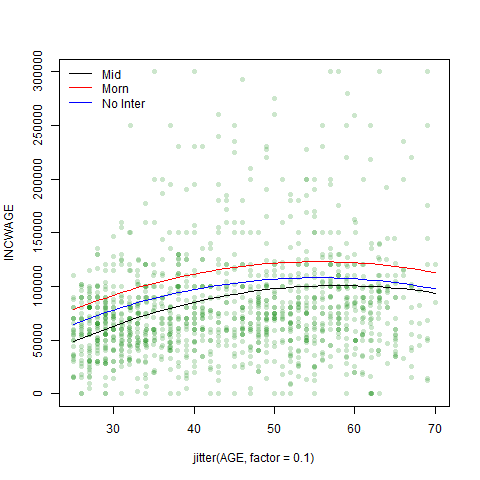

```{r include=FALSE}
knitr::opts_chunk$set(echo = FALSE)
library(stargazer)
library(dplyr)
load("acs2017_ny_data.RData")
```
```{r}
attach(acs2017_ny)
healthcare <- (IND == "7970" | IND == "7980" | IND == "7990" | IND == "8070" | IND == "8080" | IND == "8090" | IND == "8170" | IND == "8180" | IND == "8190" | IND == "8270")
use_varb <- (AGE >= 25) & (AGE <= 70) & (LABFORCE == 2) & (WKSWORK2 > 4) & (UHRSWORK >= 35) & (female == 1) & ((educ_college == 1) | (educ_advdeg == 1)) & healthcare
dat_meda <- subset(acs2017_ny, use_varb)
dat_med <- subset(dat_meda, select = -(veteran))
detach()
```
```{r include=FALSE}
library(AER)
```
For our subset, we decided to examine how different variables impact wages for people who identify as female working in the various aspects of the medical industry. We did this by creating an object that houses different industry codes pertaining to the medical field, including physician and dentist offices, hospitals, nursing facilities and other health-care practitioners.
```{r}
attach(dat_med)
graveyard <- ((DEPARTS >= 0) & (DEPARTS <= 459))
morning <- ((DEPARTS >= 500) & (DEPARTS <=930))
daytime <- ((DEPARTS >= 931) & (DEPARTS <=1700))
evening <- ((DEPARTS >= 1701) & (DEPARTS <=2359))
deptime <- factor((1*evening + 2*morning + 3*daytime + 4*graveyard), levels = c(1, 2, 3, 4), labels = c("Night", "Morn", "Mid",  "Grave"))
detach()
```
For our initial regression, we elected to use the [INCWAGE](https://cps.ipums.org/cps-action/variables/INCWAGE#description_section) observations as our measure of wage. We made this decision as we believe it is reasonable to assume that most of the data observations in our subset (females in the medical field with a Bachelor or Advanced degree) would only hold one job. INCWAGE is 'the total pre-tax and salary income' each of the respondent's earned as an employee in the previous 12 months prior to the survey.

```{r}
attach(dat_med)
lma <- lm((INCWAGE ~ AGE + I(AGE^2) + educ_college))
suppressWarnings(stargazer(lma, type = "text"))
detach()
```
The regressor coefficients from the initial regression all appear to be statistically significant, the only exception being the intercept coefficient. What is curious is that holding a Bachelor's degree has a *negative* correlation with wages within the subset. However, for our observations this makes sense; we limited our observations to people who hold Bachelor's or Advanced degrees. From an outsider's perspective of the industry, those who hold advanced degrees or extra certifications within the medical field would be those who have specialized in particular fields, commanding higher wages for their specialized knowledge. A Bachelor's degree is closer to an entry level requirement in the field, so the comparative wages are significantly lower.

From this regression, we created our prediction model using 50% of the 2626 observations in our subset in order to give the model a sizable enough sample from which to draw its comparisons. For easy visualization, the jitter has been set to 0.1, to demonstrate the trends at different ages and the range of the INCWAGE axis has been capped at 300,000.

To draw some comparison from the initial regression, we set the prediction model to predict wages for those with advanced degrees.  
```{r}
attach(dat_med)
NNobs <- length(INCWAGE)
set.seed(12345)
graph_obs <- (runif(NNobs) < 0.5)
med_graph <-subset(dat_med, graph_obs)
detach()
```
```{r include=FALSE}
plot(INCWAGE ~ jitter(AGE, factor = 0.1), pch = 16, col = rgb(0, 0.5, 0, alpha = 0.2), ylim = c(0,300000), data = med_graph)
medpredict <- data.frame(AGE = 25:70, female = 1, educ_college = 1, educ_advdeg = 1)
medpredictb <- data.frame(AGE = 25:70, female = 1, educ_college = 0, educ_advdeg = 1)
medpredictb$yhat <- predict(lma, newdata = medpredictb)
lines(yhat ~ AGE, data = medpredictb)
initmax <- max(medpredictb$yhat)
```


The plot for the predicted values shows us a gently sloped concave curve that has a peak predicted value of `r format(round(initmax, digits = 2), scientific=FALSE)`.

When we added high polynomials, $Age^3$, $Age^4$ and $Age^5$, to the regression, the absolute values of the corresponding coefficients get progressively smaller.
```{r}
lmpolys <- lm((INCWAGE ~ AGE + I(AGE^2) + I(AGE^3) + I(AGE^4) + I(AGE^5) + educ_college), data = dat_med)
suppressWarnings(stargazer(lmpolys, type = "text"))
```
```{r include=FALSE}
plot(INCWAGE ~ jitter(AGE, factor = 0.1), pch = 16, col = rgb(0, 0.5, 0, alpha = 0.2), ylim = c(0,300000), data = med_graph)
medpredictb$yhatpolys <- predict(lmpolys, newdata = medpredictb)
lines(yhatpolys ~ AGE, data = medpredictb, col = "Purple" )
lines(yhat ~ AGE, data = medpredictb, lty = 2)
legend("topleft", c("Polynomials", "Squared"), col = c("Purple", "Black"), lty = c(1,2), bty = "n")
```
```{r}
polymax <- max(medpredictb$yhatpolys)
```


When plotted, the curves follow a similar slope and shape. Adding the extra polynomials increases the maximum predicted wage slightly to `r format(round(polymax, digits = 2), scientific=FALSE)` but we notice a steepening of the "Polynomials" curve as age approaches 70. Running a joint hypothesis shows us that the higher-order polynomial terms are not significant; i.e. they have next to no relationship with how wages are determined within the dataset.

```{r incldue=FALSE}
polyrange <- sum(max(medpredictb$yhatpolys)-min(medpredictb$yhatpolys))
initialrange <- sum(max(medpredictb$yhat)-min(medpredictb$yhat))
```
```{r}
linearHypothesis(lmpolys, "I(AGE^3) + I(AGE^4) + I(AGE^5) = 0", test="F")
```

In both regression, wages as a function of age trend upwards. Wage peaks at the age of 55 in the initial regression model but peaks later, at 59, in the polynomial model. The range of predicted wages is larger in the polynomial model by `r round(sum(polyrange-initialrange), digits=2)`

If we use $log(Age)$ in our regression instead, we can clearly see that the log function flattens the predicted values towards the upper end of our age range.  
  
The log function demonstrates that the percentage changes in wage relative to the increase in age are small compared to wage changes for younger workers. The log regression curve also shows us the impact of outliers on the higher-order polynomials regression.

```{r include=FALSE}
lmlog <- lm((INCWAGE ~ AGE + log(AGE) + educ_college), data = dat_med)
plot(INCWAGE ~ jitter(AGE, factor = 1), pch = 16, col = rgb(0, 0.5, 0, alpha = 0.1), ylim = c(0,300000), data = med_graph)
medpredictb$yhatlog <- predict(lmlog, newdata = medpredictb)
lines(yhatlog ~ AGE, data = medpredictb, col = "Red")
lines(yhatpolys ~ AGE, data = medpredictb, col = "Purple" )
lines(yhat ~ AGE, data = medpredictb, lty = 2)
legend("topleft", c("Logs", "Polynomials", "Squared"), col = c("Red", "Purple", "Black"), lty = c(1,1,2), bty = "n")
logmax <- max(medpredictb$yhatlog)
comptable <- medpredictb[c(1,5,6,7)]
plot(INCWAGE ~ jitter(AGE, factor = 1), pch = 16, col = rgb(0, 0.5, 0, alpha = 0.1), ylim = c(0,300000), data = med_graph)
medpredictb$yhatlog <- predict(lmlog, newdata = medpredictb)
lines(yhatlog ~ AGE, data = medpredictb, col = "Red")
legend("topleft", "Logs", col = "Red", lty = 1, bty = "n")
```

**Dummy Variables**  
Were we to add the *educ_hs* dummy variable into this regression it would have zero effect because our dataset only includes those with a Bachelor or Advanced degree. However, if we add both the *educ_college* and *educ_advdeg*, we fall into the dummy variable trap - all observations will satisfy one or the other category. To draw relevant insights from the regression, we need to exclude one category from the regression. If we had these dummy variables coded into a factor, we can have R exclude any particular category by changing the order in which the categories are included in the factor. Similarly, if both dummy variables are included in the regression, we can make sure R excludes the relevant dummy by changing their order.

We don't apply polynomials or logs to the dummy variables as they will not have any effect on the regression. $1^x = 1$; $0^x = 0$.

Here are some predicted values for each of the three regression models that we have created.
```{r}
display <- filter(comptable, (AGE >=57 & AGE <=61 | AGE >=30 & AGE <=34))
display
```
The predicted values demonstrate the upward trend of wages towards the late 50s of those working in the medical field. The predicted values seem to make sense. Younger professionals earn less than their more experienced counterparts. The gap between more experience physicians and their contemporaries working in other hospitals jobs, such as janitors or caterers, would be greater. Glied, Ma and Pearlsteins' 2015 [article](https://www.healthaffairs.org/doi/full/10.1377/hlthaff.2014.1367) has a succinct depiction of the differences between Physicians, Nurses and other health industry workers in the first results table. Their data comes from the 2014 CPS data and is reported in 2013 dollars.


**Elasticity**  
By changing the dependent variable to log(INCWAGE), we encountered an error as there are 45 observations in the dataset that have INCWAGE = 0. To get around this issue, we asked the regression to take $log(INCWAGE + 1)$ to remove the issue of the 0 values whilst minimizing the impact on the other observations. The observed values are generally big enough that the addition of 1 does not impact the log of the observations with any significance.
```{r}
lmlogb <- lm((log(INCWAGE + 1) ~ AGE + log(AGE) + educ_college), data = dat_med)
plot(log(INCWAGE + 1) ~ jitter(AGE, factor = 2), pch = 16, col = rgb(0, 0.5, 0, alpha = 0.1), ylim = c(0,20), data = med_graph)
medpredictb$yhatlogfun <- predict(lmlogb, newdata = medpredictb)
lines(yhatlogfun ~ AGE, data = medpredictb, col = "Orange")
legend("topleft", "Log of log", col = "Orange", lty = 1, bty = "n")
```

  Here we compare INCWAGE ~ log(AGE) and log(INCWAGE + 1) ~ log(AGE)

 

```{r}
logcomps <- medpredictb[c(1,7,8)]
head(logcomps)
```
Changing our dependent variable to log(INCWAGE + 1) depicts the percentage change in wages in response to a percentage change in age. While the pattern of predicted values in the regression with INCWAGE trends upwards until age reaches the mid 50s, then begins to trend down, the predicted values for log(INCWAGE + 1) stay consistent at approximately `r mean(medpredictb$yhatlogfun)`. If we take the log of this value, we see that a 1% increase in age has a corresponding average increase of `r log(mean(medpredictb$yhatlogfun))` in wages. 

**Interactions**  
For our interactions, we add a factor based on the times workers leave their homes to get to work. The factor is split into 4 time periods, `r levels(deptime)`, corresponding to (5am-9:30am), (9:31am-5:00pm), (5:01pm-11:59pm) and (12:00-4:59am) respectively.  

We chose departure time because we believe the time someone leaves for work would be a strong indicator of how much they make in wages. We take the assumption that most people prefer to work during daytime hours. Research has shown that human biology follows a [circadian rhythm](https://www.sleepfoundation.org/circadian-rhythm#:~:text=The%20sleep%2Dwake%20cycle%20is,keep%20us%20awake%20and%20active) to allow the brain and body to be awake and alert during the sunny hours and rest at nighttime. We expect that those who have departure times during the day time would have higher incomes than those who have "less desirable" departure times, such as a graveyard shift at a hospital.

```{r include=FALSE}
dtab <- table(deptime)
dtab
depprop <- (sum(morning==1))/(sum(dtab))
```
`r round(depprop, digits=2)` of observations in the dataset depart for work between 5am and 9am. We assume that these healthcare workers comprise of practitioners and managerial or administrative personnel. It is the commute time for the most desirable and most common working hours. We expect graveyard shift workers to have the next highest predicted wages, as they receive the pay differential for working odd hours. Lastly, we expect to see Mid and Night departure times with the lowest level of predicted wages.

```{r}
lminter <- lm(INCWAGE ~ AGE + I(AGE^2) + deptime + educ_college + (deptime*AGE) + (deptime*(AGE^2)) + (deptime*educ_college), data=dat_med)
summary(lminter)
```
```{r include=FALSE}
lmDepHealth2 <- lm((INCWAGE ~ AGE + I(AGE^2) + educ_college + deptime), data=dat_med)
plot(INCWAGE ~ jitter(AGE, factor = 0.1), pch = 16, col = rgb(0, 0.5, 0, alpha = 0.2), ylim = c(0,300000), data = med_graph)
medpredict1 <- data.frame(AGE = 25:70, female = 1, educ_college = 0, deptime = "Mid")
medpredict1$yhatnoint <- predict(lmDepHealth2, newdata = medpredict1)
medpredict1$yhat <- predict(lminter, newdata = medpredict1)
medpredict2 <- data.frame(AGE = 25:70, female = 1, educ_college = 0, deptime = "Morn")
medpredict2$yhat <- predict(lminter, newdata = medpredict2)
lines(yhat ~ AGE, data = medpredict1, col = "Black")
lines(yhat ~ AGE, data = medpredict2, col = "Red")
lines(yhatnoint ~ AGE, data = medpredict1, col = "Blue")
legend("topleft", c("Mid", "Morn", "No Inter"), lty=1, col = c("Black", "Red", "Blue"), bty="n")
peakvalues <- c(max(medpredict1$yhat), max(medpredict2$yhat), max(medpredict1$yhatnoint))
peakvalues
```
Including the deptime factor produces outputs that appear to have no bearing on determining predicted wages. We may have included too many interactions, reducing the sizes of the subsets within the regression. Here is a plot with regression lines for the interactions and one regression without interactions.  
  
The three curves have different peaks `r format(peakvalues, scientific=FALSE)` for Mid Departure, Morn Departure and no interactions respectively.

### Our Regression Model: Departure Time and Health Insurance  
The interactions regression suggested that the departure times of healthcare workers have no significant relationship with their wages. However, we may have built in too many interactions for our dataset. Here, we remove the interactions and focus on a simpler regression.

We also include health insurance. As health insurance is usually a benefit for many well paid jobs, we are expecting to see that people with health insurance have higher wages. The proportion of healthcare workers in the subset with health insurance is ~97.94%. We may not see a large enough difference between the two groups for it to be statistically significant. Let's see what the regression tells us.

```{r}
lmDepHealth <- lm((INCWAGE ~ AGE + I(AGE^2) + educ_college + deptime + HCOVANY), data = dat_med)
summary(lmDepHealth)
```

The results seem to indicate that health insurance is not statistically significant. The high p-value of ~0.40908 suggests a relationship does not exist between health insurance and wages. This seems to confirm what we had suspected when looking at the proportion of observations with health insurance.

Here is a regression isolating the health insurance variable to see how the p-value changes.

```{r, eval= FALSE}
lmDepHealth1 <- lm((INCWAGE ~ AGE + I(AGE^2) + HCOVANY), data = dat_med)
summary(lmDepHealth1)
```
The health insurance variable by itself still shows a high p-value of ~0.19885. We would fail to reject the null hypothesis that "no relationship exists between health insurance and wages." The variable HCOVANY would not be useful in helping us predict wages. We will not include it in our regression model. Instead, we focus on departure time.

For departure time, we would expect that those departing during the morning hours (5am-9am) would earn the most as most of these roles are administrative and managerial, followed by the healthcare workers who work the graveyard shift due to the pay differential. And lastly, daytime and evening commuters would have wages slightly less.
```{r}
summary(lmDepHealth2)
```
Running this regression model with the departure time shows p-values of ~0.09 for both Night and Morning departure times. We would fail to reject the null hypothesis at the 5% level of significance, perhaps saying that there is no relationship between Night and Morning departure times and wages. The "mid" (9:31am - 5pm) departure time appears to show that there is a relationship between leaving for work in the middle of the day and a healthcare worker's wages.  

We note that R has dropped a dummy variable from our factor, namely the Graveyard departure time. To fix this, we will reorder the factor to drop off either the Night or Morning shift instead, as we determined both of these were not statistically significant at the 5% level of significance.  

After adjusting our factors for departure time, we can see that Graveyard and Midday are still statistically significant with p-values less than 0.05.

```{r include=FALSE}
plot(INCWAGE ~ jitter(AGE, factor = 0.1), pch = 16, col = rgb(0, 0.5, 0, alpha = 0.2), ylim = c(0,300000), data = med_graph)
medpredict1 <- data.frame(AGE = 25:70, female = 1, educ_college = 1, deptime = "Mid")
medpredict2 <- data.frame(AGE = 25:70, female = 1, educ_college = 1, deptime = "Grave")
medpredict1$yhat <- predict(lmDepHealth2, newdata = medpredict1)
medpredict2$yhat <- predict(lmDepHealth2, newdata = medpredict2)
lines(yhat ~ AGE, data = medpredict1, col = "Black")
lines(yhat ~ AGE, data = medpredict2, col = "Red")
legend("topleft", c("Grave", "Mid"), lty = 1, col=c("Red", "Black"), bty = "n")
max(medpredict1$yhat) #peak predicted wage for Mid 
max(medpredict2$yhat) #peak predicted wage for Grave
```
  
Based on our plotted regression line, the Graveyard commute gets paid slightly more than the Mid commute healthcare workers. The difference does not seem to be very large. Looking at the peak wages of 73446 for Graveyard departure times and 72387 for Mid departure times, this is only a 1.46% difference in peak predicted wages. The difference in estimated coefficients from the regression output above match what the peak predicted values indicate; the difference between is the change in y-intercept, not the slope of the curve.

We would predict slightly higher wages for those workers who have a Graveyard commute than those with a Midday commute. This did not match our expectations; we thought workers with a Morning commute would have the highest predicted wages but this variable ended up being not statistically significant.  

In terms of considering this correlation to be a casual link, we would have to look into deeper why the Morning and Night commutes are non-significant at the 5% level. We need to make sure that the variation of departure time and wages change together. The inclusion of the health insurance variable demonstrated that the relationship between the independent and dependent variables was not definitively X to Y - rather, it is more likely the case that many of the observations had health insurance because a) they work in the field and b) they are well paid and can afford to purchase insurance.

It's evident that each regression model, be it with polynomials, logs or interactions, suits different purposes and highlights different information. We quickly ascertained from the interaction regression that perhaps less is more (or perhaps keener insight into the impact of interactions on a dataset of the size we have) and while it gave us a broad insight into the effect of departure time, we were able to parse out clearer information when we reverted to a more basic regression. Understanding the context of the data and having a clear idea of how the variables will interact with each other are important skills necessary to effectively utilize these models.

### Bibliography
https://cps.ipums.org/cps-action/variables/INCWAGE#description_section

Glied, Sherry A., Ma, Stephanie  and Pearlstein, Ivanna, (2015). "Understanding Pay Differentials Among Health Professionals, Nonprofessionals, And Their Counterparts In Other Sectors", https://www.healthaffairs.org/doi/full/10.1377/hlthaff.2014.1367

Suni, Eric., (2020) "Circadian Rhythm", https://www.sleepfoundation.org/circadian-rhythm#:~:text=The%20sleep%2Dwake%20cycle%20is,keep%20us%20awake%20and%20active

