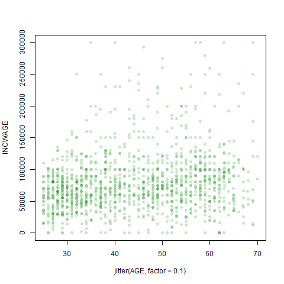
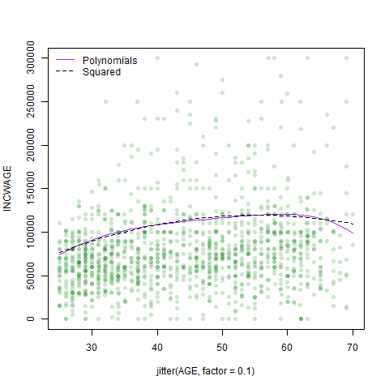
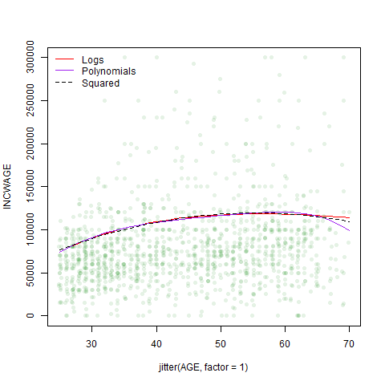
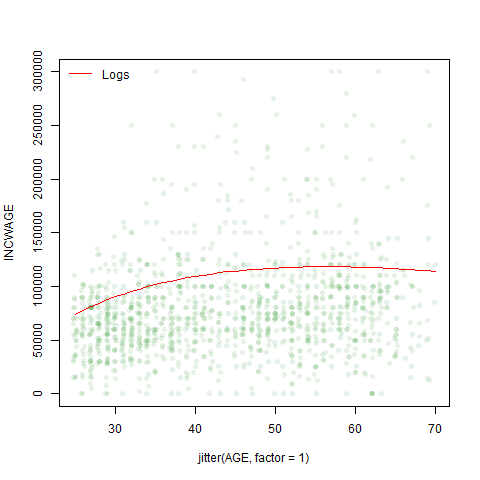
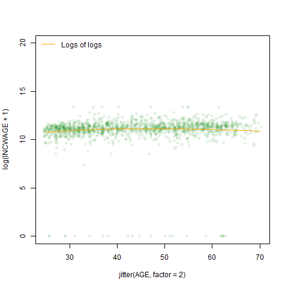

Homework 5
================
Patrick Sinclair, Kieran Yuen

For our subset, we decided to examine how different variables impact
wages for people who identify as female working in the various aspects
of the medical industry. We did this by creating an object that houses
different industry codes pertaining to the medical field, including
physician and dentist offices, hospitals, nursing facilities and other
health-care practitioners.

For our initial regression, we elected to use the
[INCWAGE](https://cps.ipums.org/cps-action/variables/INCWAGE#description_section)
observations as our measure of wage. We made this decision as we believe
it is reasonable to assume that most of the data observations in our
subset (females in the medical field with a Bachelor or Advanced degree)
would only hold one job. INCWAGE is ‘the total pre-tax and salary
income’ each of the respondent’s earned as an employee in the previous
12 months prior to the survey.

    ## 
    ## ==========================================================
    ##                              Dependent variable:          
    ##                     --------------------------------------
    ##                     INCWAGE ~ AGE + I(AGE2) + educ_college
    ## ----------------------------------------------------------
    ## AGE                              5,121.620***             
    ##                                   (987.179)               
    ##                                                           
    ## I(AGE2)                           -46.251***              
    ##                                    (10.823)               
    ##                                                           
    ## educ_college                    -35,171.720***            
    ##                                  (2,897.363)              
    ##                                                           
    ## Constant                         -22,289.850              
    ##                                  (21,349.910)             
    ##                                                           
    ## ----------------------------------------------------------
    ## Observations                        2,626                 
    ## R2                                  0.082                 
    ## Adjusted R2                         0.081                 
    ## Residual Std. Error         73,930.770 (df = 2622)        
    ## F Statistic                77.788*** (df = 3; 2622)       
    ## ==========================================================
    ## Note:                          *p<0.1; **p<0.05; ***p<0.01

The regressor coefficients from the initial regression all appear to be
statistically significant, the only exception being the intercept
coefficient. What is curious is that holding a Bachelor’s degree has a
*negative* correlation with wages within the subset, as does \(Age^2\).
However, for our observations this makes sense; we limited our
observations to people who hold Bachelor’s or Advanced degrees. From an
outsider’s perspective of the industry, those whole hold advanced
degrees or extra certifications within the medical field would be those
who have specialized in particular fields, commanding higher wages for
their specialized knowledge. A Bachelor’s degree is closer to an entry
level requirement in the field, so the comparative wages are
significantly lower.

From this regression, we created our prediction model using 50% of the
2626 observations in our subset in order to give the model a sizable
enough sample from which to draw its comparisons. For easy
visualization, the jitter has been set to 0.1, to demonstrate the trends
at different ages and the range of the INCWAGE axis has been capped at
300,000.

To draw some comparison from the linear regression, we set the
prediction model to predict wages for those with advanced degrees.

The plot for the predicted values shows us a gently sloped concave curve
that has a peak predicted value of 119489.4.

When we added high polynomials, \(Age^3\), \(Age^4\) and \(Age^5\), to
the regression, the absolute values of the corresponding coefficients
get progressively smaller.

    ## 
    ## ========================================================================================
    ##                                             Dependent variable:                         
    ##                     --------------------------------------------------------------------
    ##                     INCWAGE ~ AGE + I(AGE2) + I(AGE3) + I(AGE4) + I(AGE5) + educ_college
    ## ----------------------------------------------------------------------------------------
    ## AGE                                              6,701.787                              
    ##                                                (143,188.500)                            
    ##                                                                                         
    ## I(AGE2)                                           282.990                               
    ##                                                 (6,578.649)                             
    ##                                                                                         
    ## I(AGE3)                                           -16.410                               
    ##                                                  (147.274)                              
    ##                                                                                         
    ## I(AGE4)                                            0.276                                
    ##                                                   (1.609)                               
    ##                                                                                         
    ## I(AGE5)                                            -0.002                               
    ##                                                   (0.007)                               
    ##                                                                                         
    ## educ_college                                   -35,144.240***                           
    ##                                                 (2,909.189)                             
    ##                                                                                         
    ## Constant                                        -106,948.300                            
    ##                                               (1,213,726.000)                           
    ##                                                                                         
    ## ----------------------------------------------------------------------------------------
    ## Observations                                       2,626                                
    ## R2                                                 0.082                                
    ## Adjusted R2                                        0.080                                
    ## Residual Std. Error                        73,953.420 (df = 2619)                       
    ## F Statistic                               39.103*** (df = 6; 2619)                      
    ## ========================================================================================
    ## Note:                                                        *p<0.1; **p<0.05; ***p<0.01

When plotted, the curves follow a similar slope and shape. Adding the
extra polynomials increases the maximum predicted wage slightly to
120590.2 but we notice a steepening of the “Polynomials” curve as age
approaches 70. Running a joint hypothesis shows us that the higher-order
polynomial terms are not significant; i.e. they have next to
relationship with how wages are determined within the dataset.

    ## Linear hypothesis test
    ## 
    ## Hypothesis:
    ## I(AGE^3)  + I(AGE^4)  + I(AGE^5) = 0
    ## 
    ## Model 1: restricted model
    ## Model 2: INCWAGE ~ AGE + I(AGE^2) + I(AGE^3) + I(AGE^4) + I(AGE^5) + educ_college
    ## 
    ##   Res.Df        RSS Df Sum of Sq      F Pr(>F)
    ## 1   2620 1.4324e+13                           
    ## 2   2619 1.4324e+13  1  67104124 0.0123 0.9118

In both regression, wages as a function of age trend upwards. Wage peaks
at the age of 55 in the initial regression model but peaks later, at 59,
in the polynomial model. The range of predicted wages is larger in the
polynomial model by 4549.33

If we use \(log(Age)\) in our regression instead, we can clearly see
that the log function flattens the predicted values towards the upper
end of our age range.  
  
The log function demonstrates that the percentage changes in wage
relative to the increase in age are small compared to wage changes for
younger workers. The log regression curve also shows us the impact of
outliers on the higher-order polynomials regression.

**Dummy Variables**  
Were we to add the *educ\_hs* dummy variable into this regression it
would have zero effect because our dataset only includes those with a
Bachelor or Advanced degree. However, if we add both the *educ\_college*
and *educ\_advdeg*, we fall into the dummy variable trap - all
observations will satisfy one or the other category. To draw relevant
insights from the regression, we need to exclude one category from the
regression. If we had these dummy variables coded into a factor, we can
have R exclude any particular category by changing the order in which
the categories are included in the factor. Similarly, if both dummy
variables are included in the regression, we can make sure R excludes
the relevant dummy by changing their order.

We don’t apply polynomials or logs to the dummy variables as they will
not have any effect on the regression. \(1^x = 1\); \(0^x = 0\).

**Are your other dummy variables in the regression working sensibly with
your selection criteria?**

Here are some predicted values for each of the three regression models
that we have created.

    ##    AGE      yhat yhatpolys   yhatlog
    ## 1   30  89732.67  90835.37  90170.61
    ## 2   31  92032.97  93491.93  92776.40
    ## 3   32  94240.76  95905.31  95201.80
    ## 4   33  96356.05  98091.90  97457.92
    ## 5   34  98378.84 100068.70  99554.87
    ## 6   57 119372.33 120234.18 118342.81
    ## 7   58 119175.06 120485.35 118280.71
    ## 8   59 118885.29 120590.21 118167.10
    ## 9   60 118503.02 120514.80 118003.71
    ## 10  61 118028.24 120220.65 117792.18

The predicted values demonstrate the upward trend of wages towards the
late 50s of those working in the medical field. The predicted values
seem to make sense. Younger professionals earn less than their more
experienced counterparts. The gap between more experience physicians and
their contemporaries working in other hospitals jobs, such as janitors
or caterers, would be greater. Glied, Ma and Pearlsteins’ 2015
[article](https://www.healthaffairs.org/doi/full/10.1377/hlthaff.2014.1367)
has a succinct depiction of the differences between Physicians, Nurses
and other health industry workers in the first results table. Their data
comes from the 2014 CPS data and is reported in 2013 dollars.

What is difference in regression from using log wage as the dependent
variable? Compare the pattern of predicted values from the two models
(remember to take exp() of the predicted value, where the dependent is
log wage). Discuss.

By changing the dependent variable to log(INCWAGE), we encountered an
error as there are 45 observations in the dataset that have INCWAGE = 0.
To get around this issue, we asked the regression to take
\(log(INCWAGE + 1)\) to remove the issues of the 0 values whilst
minimizing the impact on the other observations. The observed values are
generally big enough that the addition of 1 does not impact the log of
the observations with any significance.

Here we compare INCWAGE \~ log(AGE) and log(INCWAGE + 1) \~ log(AGE)

 

    ##    AGE female educ_college educ_advdeg
    ## 1   25      1            1           1
    ## 2   26      1            1           1
    ## 3   27      1            1           1
    ## 4   28      1            1           1
    ## 5   29      1            1           1
    ## 6   30      1            1           1
    ## 7   31      1            1           1
    ## 8   32      1            1           1
    ## 9   33      1            1           1
    ## 10  34      1            1           1
    ## 11  35      1            1           1
    ## 12  36      1            1           1
    ## 13  37      1            1           1
    ## 14  38      1            1           1
    ## 15  39      1            1           1
    ## 16  40      1            1           1
    ## 17  41      1            1           1
    ## 18  42      1            1           1
    ## 19  43      1            1           1
    ## 20  44      1            1           1
    ## 21  45      1            1           1
    ## 22  46      1            1           1
    ## 23  47      1            1           1
    ## 24  48      1            1           1
    ## 25  49      1            1           1
    ## 26  50      1            1           1
    ## 27  51      1            1           1
    ## 28  52      1            1           1
    ## 29  53      1            1           1
    ## 30  54      1            1           1
    ## 31  55      1            1           1
    ## 32  56      1            1           1
    ## 33  57      1            1           1
    ## 34  58      1            1           1
    ## 35  59      1            1           1
    ## 36  60      1            1           1
    ## 37  61      1            1           1
    ## 38  62      1            1           1
    ## 39  63      1            1           1
    ## 40  64      1            1           1
    ## 41  65      1            1           1
    ## 42  66      1            1           1
    ## 43  67      1            1           1
    ## 44  68      1            1           1
    ## 45  69      1            1           1
    ## 46  70      1            1           1

    ## Warning in mean.default(medpredict$yhat): argument is not numeric or logical:
    ## returning NA

    ## [1] NA

    ## Warning in mean.default(medpredict$yhatlog): argument is not numeric or logical:
    ## returning NA

    ## [1] NA

Try some interactions, like this,

    ## 
    ## Call:
    ## lm(formula = INCWAGE ~ AGE + I(AGE^2) + educ_college + I(educ_college * 
    ##     AGE) + I(educ_college * (AGE^2)))
    ## 
    ## Coefficients:
    ##               (Intercept)                        AGE  
    ##                 -98495.49                    8058.95  
    ##                  I(AGE^2)               educ_college  
    ##                    -71.89                   92301.75  
    ##     I(educ_college * AGE)  I(educ_college * (AGE^2))  
    ##                  -4863.83                      41.81

    ## 
    ## Call:
    ## lm(formula = INCWAGE ~ AGE + I(AGE^2) + educ_college + I(educ_college * 
    ##     AGE) + educ_advdeg + I(educ_advdeg * AGE))
    ## 
    ## Coefficients:
    ##           (Intercept)                    AGE               I(AGE^2)  
    ##             -54253.84                5971.18                 -49.01  
    ##          educ_college  I(educ_college * AGE)            educ_advdeg  
    ##              12721.32               -1071.56                     NA  
    ##  I(educ_advdeg * AGE)  
    ##                    NA

and explain those outputs (different peaks for different groups).

What are the other variables you are using in your regression? Do they
have the expected signs and patterns of significance? Explain if there
is a plausible causal link from X variables to Y and not the reverse.
Explain your results, giving details about the estimation, some
predicted values, and providing any relevant graphics. Impress.

### Bibliography

<https://cps.ipums.org/cps-action/variables/INCWAGE#description_section>

Glied, Sherry A., Ma, Stephanie and Pearlstein, Ivanna, (2015).
“Understanding Pay Differentials Among Health Professionals,
Nonprofessionals, And Their Counterparts In Other Sectors”
<https://www.healthaffairs.org/doi/full/10.1377/hlthaff.2014.1367>

Our Regression Model: Departure Time and Health Insurance
