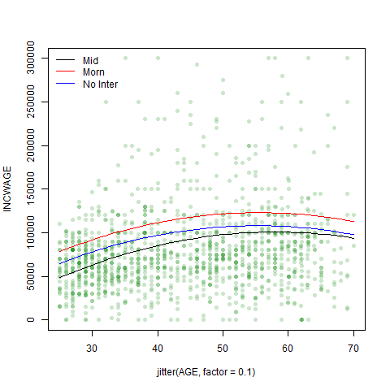
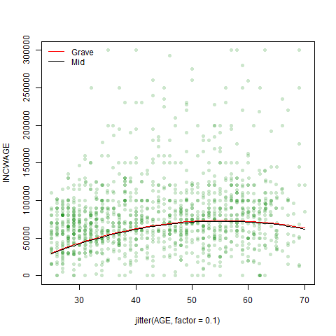

Homework 5
================
Patrick Sinclair, Kieran Yuen

For our subset, we decided to examine how different variables impact
wages for people who identify as female working in the various aspects
of the medical industry. We did this by creating an object that houses
different industry codes pertaining to the medical field, including
physician and dentist offices, hospitals, nursing facilities and other
health-care practitioners.

For our initial regression, we elected to use the
[INCWAGE](https://cps.ipums.org/cps-action/variables/INCWAGE#description_section)
observations as our measure of wage. We made this decision as we believe
it is reasonable to assume that most of the data observations in our
subset (females in the medical field with a Bachelor or Advanced degree)
would only hold one job. INCWAGE is ‘the total pre-tax and salary
income’ each of the respondent’s earned as an employee in the previous
12 months prior to the survey.

    ## 
    ## ==========================================================
    ##                              Dependent variable:          
    ##                     --------------------------------------
    ##                     INCWAGE ~ AGE + I(AGE2) + educ_college
    ## ----------------------------------------------------------
    ## AGE                              5,121.620***             
    ##                                   (987.179)               
    ##                                                           
    ## I(AGE2)                           -46.251***              
    ##                                    (10.823)               
    ##                                                           
    ## educ_college                    -35,171.720***            
    ##                                  (2,897.363)              
    ##                                                           
    ## Constant                         -22,289.850              
    ##                                  (21,349.910)             
    ##                                                           
    ## ----------------------------------------------------------
    ## Observations                        2,626                 
    ## R2                                  0.082                 
    ## Adjusted R2                         0.081                 
    ## Residual Std. Error         73,930.770 (df = 2622)        
    ## F Statistic                77.788*** (df = 3; 2622)       
    ## ==========================================================
    ## Note:                          *p<0.1; **p<0.05; ***p<0.01

The regressor coefficients from the initial regression all appear to be
statistically significant, the only exception being the intercept
coefficient. What is curious is that holding a Bachelor’s degree has a
*negative* correlation with wages within the subset. However, for our
observations this makes sense; we limited our observations to people who
hold Bachelor’s or Advanced degrees. From an outsider’s perspective of
the industry, those who hold advanced degrees or extra certifications
within the medical field would be those who have specialized in
particular fields, commanding higher wages for their specialized
knowledge. A Bachelor’s degree is closer to an entry level requirement
in the field, so the comparative wages are significantly lower.

From this regression, we created our prediction model using 50% of the
2626 observations in our subset in order to give the model a sizable
enough sample from which to draw its comparisons. For easy
visualization, the jitter has been set to 0.1, to demonstrate the trends
at different ages and the range of the INCWAGE axis has been capped at
300,000.

To draw some comparison from the initial regression, we set the
prediction model to predict wages for those with advanced degrees.

The plot for the predicted values shows us a gently sloped concave curve
that has a peak predicted value of 119489.4.

When we added high polynomials, \(Age^3\), \(Age^4\) and \(Age^5\), to
the regression, the absolute values of the corresponding coefficients
get progressively smaller.

    ## 
    ## ========================================================================================
    ##                                             Dependent variable:                         
    ##                     --------------------------------------------------------------------
    ##                     INCWAGE ~ AGE + I(AGE2) + I(AGE3) + I(AGE4) + I(AGE5) + educ_college
    ## ----------------------------------------------------------------------------------------
    ## AGE                                              6,701.787                              
    ##                                                (143,188.500)                            
    ##                                                                                         
    ## I(AGE2)                                           282.990                               
    ##                                                 (6,578.649)                             
    ##                                                                                         
    ## I(AGE3)                                           -16.410                               
    ##                                                  (147.274)                              
    ##                                                                                         
    ## I(AGE4)                                            0.276                                
    ##                                                   (1.609)                               
    ##                                                                                         
    ## I(AGE5)                                            -0.002                               
    ##                                                   (0.007)                               
    ##                                                                                         
    ## educ_college                                   -35,144.240***                           
    ##                                                 (2,909.189)                             
    ##                                                                                         
    ## Constant                                        -106,948.300                            
    ##                                               (1,213,726.000)                           
    ##                                                                                         
    ## ----------------------------------------------------------------------------------------
    ## Observations                                       2,626                                
    ## R2                                                 0.082                                
    ## Adjusted R2                                        0.080                                
    ## Residual Std. Error                        73,953.420 (df = 2619)                       
    ## F Statistic                               39.103*** (df = 6; 2619)                      
    ## ========================================================================================
    ## Note:                                                        *p<0.1; **p<0.05; ***p<0.01

When plotted, the curves follow a similar slope and shape. Adding the
extra polynomials increases the maximum predicted wage slightly to
120590.2 but we notice a steepening of the “Polynomials” curve as age
approaches 70. Running a joint hypothesis shows us that the higher-order
polynomial terms are not significant; i.e. they have next to no
relationship with how wages are determined within the dataset.

    ## Linear hypothesis test
    ## 
    ## Hypothesis:
    ## I(AGE^3)  + I(AGE^4)  + I(AGE^5) = 0
    ## 
    ## Model 1: restricted model
    ## Model 2: INCWAGE ~ AGE + I(AGE^2) + I(AGE^3) + I(AGE^4) + I(AGE^5) + educ_college
    ## 
    ##   Res.Df        RSS Df Sum of Sq      F Pr(>F)
    ## 1   2620 1.4324e+13                           
    ## 2   2619 1.4324e+13  1  67104124 0.0123 0.9118

In both regression, wages as a function of age trend upwards. Wage peaks
at the age of 55 in the initial regression model but peaks later, at 59,
in the polynomial model. The range of predicted wages is larger in the
polynomial model by 4549.33

If we use \(log(Age)\) in our regression instead, we can clearly see
that the log function flattens the predicted values towards the upper
end of our age range.  
  
The log function demonstrates that the percentage changes in wage
relative to the increase in age are small compared to wage changes for
younger workers. The log regression curve also shows us the impact of
outliers on the higher-order polynomials regression.

**Dummy Variables**  
Were we to add the *educ\_hs* dummy variable into this regression it
would have zero effect because our dataset only includes those with a
Bachelor or Advanced degree. However, if we add both the *educ\_college*
and *educ\_advdeg*, we fall into the dummy variable trap - all
observations will satisfy one or the other category. To draw relevant
insights from the regression, we need to exclude one category from the
regression. If we had these dummy variables coded into a factor, we can
have R exclude any particular category by changing the order in which
the categories are included in the factor. Similarly, if both dummy
variables are included in the regression, we can make sure R excludes
the relevant dummy by changing their order.

We don’t apply polynomials or logs to the dummy variables as they will
not have any effect on the regression. \(1^x = 1\); \(0^x = 0\).

Here are some predicted values for each of the three regression models
that we have created.

    ##    AGE      yhat yhatpolys   yhatlog
    ## 1   30  89732.67  90835.37  90170.61
    ## 2   31  92032.97  93491.93  92776.40
    ## 3   32  94240.76  95905.31  95201.80
    ## 4   33  96356.05  98091.90  97457.92
    ## 5   34  98378.84 100068.70  99554.87
    ## 6   57 119372.33 120234.18 118342.81
    ## 7   58 119175.06 120485.35 118280.71
    ## 8   59 118885.29 120590.21 118167.10
    ## 9   60 118503.02 120514.80 118003.71
    ## 10  61 118028.24 120220.65 117792.18

The predicted values demonstrate the upward trend of wages towards the
late 50s of those working in the medical field. The predicted values
seem to make sense. Younger professionals earn less than their more
experienced counterparts. The gap between more experience physicians and
their contemporaries working in other hospitals jobs, such as janitors
or caterers, would be greater. Glied, Ma and Pearlsteins’ 2015
[article](https://www.healthaffairs.org/doi/full/10.1377/hlthaff.2014.1367)
has a succinct depiction of the differences between Physicians, Nurses
and other health industry workers in the first results table. Their data
comes from the 2014 CPS data and is reported in 2013 dollars.

**Elasticity**  
By changing the dependent variable to log(INCWAGE), we encountered an
error as there are 45 observations in the dataset that have INCWAGE = 0.
To get around this issue, we asked the regression to take
\(log(INCWAGE + 1)\) to remove the issue of the 0 values whilst
minimizing the impact on the other observations. The observed values are
generally big enough that the addition of 1 does not impact the log of
the observations with any significance.
<!-- -->

Here we compare INCWAGE \~ log(AGE) and log(INCWAGE + 1) \~ log(AGE)

 

    ##   AGE  yhatlog yhatlogfun
    ## 1  25 73958.43   10.74424
    ## 2  26 77678.45   10.79046
    ## 3  27 81141.96   10.83278
    ## 4  28 84367.65   10.87147
    ## 5  29 87372.20   10.90679
    ## 6  30 90170.61   10.93897

Changing our dependent variable to log(INCWAGE + 1) depicts the
percentage change in wages in response to a percentage change in age.
While the pattern of predicted values in the regression with INCWAGE
trends upwards until age reaches the mid 50s, then begins to trend down,
the predicted values for log(INCWAGE + 1) stay consistent at
approximately 11.0375274. If we take the log of this value, we see that
a 1% increase in age has a corresponding average increase of 2.4013011
in wages.

**Interactions**  
For our interactions, we add a factor based on the times workers leave
their homes to get to work. The factor is split into 4 time periods,
Night, Morn, Mid, Grave, corresponding to (5am-9:30am), (9:31am-5:00pm),
(5:01pm-11:59pm) and (12:00-4:59am) respectively.

We chose departure time because we believe the time someone leaves for
work would be a strong indicator of how much they make in wages. We take
the assumption that most people prefer to work during daytime hours.
Research has shown that human biology follows a [circadian
rhythm](https://www.sleepfoundation.org/circadian-rhythm#:~:text=The%20sleep%2Dwake%20cycle%20is,keep%20us%20awake%20and%20active)
to allow the brain and body to be awake and alert during the sunny hours
and rest at nighttime. We expect that those who have departure times
during the day time would have higher incomes than those who have “less
desirable” departure times, such as a graveyard shift at a hospital.

0.81 of observations in the dataset depart for work between 5am and 9am.
We assume that these healthcare workers comprise of practitioners and
managerial or administrative personnel. It is the commute time for the
most desirable and most common working hours. We expect graveyard shift
workers to have the next highest predicted wages, as they receive the
pay differential for working odd hours. Lastly, we expect to see Mid and
Night departure times with the lowest level of predicted wages.

    ## 
    ## Call:
    ## lm(formula = INCWAGE ~ AGE + I(AGE^2) + deptime + educ_college + 
    ##     (deptime * AGE) + (deptime * (AGE^2)) + (deptime * educ_college), 
    ##     data = dat_med)
    ## 
    ## Residuals:
    ##     Min      1Q  Median      3Q     Max 
    ## -123025  -35288  -10221   16683  576257 
    ## 
    ## Coefficients:
    ##                            Estimate Std. Error t value Pr(>|t|)    
    ## (Intercept)                -3232.52   30612.27  -0.106   0.9159    
    ## AGE                         4775.47    1054.78   4.527 6.24e-06 ***
    ## I(AGE^2)                     -48.40      10.84  -4.465 8.35e-06 ***
    ## deptimeMorn               -22627.20   24160.88  -0.937   0.3491    
    ## deptimeMid                -58581.23   31158.26  -1.880   0.0602 .  
    ## deptimeGrave              -34880.00   36677.15  -0.951   0.3417    
    ## educ_college              -21703.35   13500.31  -1.608   0.1080    
    ## AGE:deptimeMorn              593.86     463.27   1.282   0.2000    
    ## AGE:deptimeMid               835.64     613.97   1.361   0.1736    
    ## AGE:deptimeGrave             422.03     722.38   0.584   0.5591    
    ## deptimeMorn:educ_college  -17294.45   13870.83  -1.247   0.2126    
    ## deptimeMid:educ_college     4599.94   17033.89   0.270   0.7871    
    ## deptimeGrave:educ_college  -1772.52   19123.19  -0.093   0.9262    
    ## ---
    ## Signif. codes:  0 '***' 0.001 '**' 0.01 '*' 0.05 '.' 0.1 ' ' 1
    ## 
    ## Residual standard error: 73770 on 2613 degrees of freedom
    ## Multiple R-squared:  0.08886,    Adjusted R-squared:  0.08468 
    ## F-statistic: 21.24 on 12 and 2613 DF,  p-value: < 2.2e-16

Including the deptime factor produces outputs that appear to have no
bearing on determining predicted wages. We may have included too many
interactions, reducing the sizes of the subsets within the regression.
Here is a plot with regression lines for the interactions and one
regression without interactions.  
  
The three curves have different peaks 100796.3, 123028.2, 108024.7 for
Mid Departure, Morn Departure and no interactions respectively.

### Our Regression Model: Departure Time and Health Insurance

The interactions regression suggested that the departure times of
healthcare workers have no significant relationship with their wages.
However, we may have built in too many interactions for our dataset.
Here, we remove the interactions and focus on a simpler regression.

We also include health insurance. As health insurance is usually a
benefit for many well paid jobs, we are expecting to see that people
with health insurance have higher wages. The proportion of healthcare
workers in the subset with health insurance is \~97.94%. We may not see
a large enough difference between the two groups for it to be
statistically significant. Let’s see what the regression tells us.

    ## 
    ## Call:
    ## lm(formula = (INCWAGE ~ AGE + I(AGE^2) + educ_college + deptime + 
    ##     HCOVANY), data = dat_med)
    ## 
    ## Residuals:
    ##     Min      1Q  Median      3Q     Max 
    ## -120895  -35298  -10369   16767  573983 
    ## 
    ## Coefficients:
    ##               Estimate Std. Error t value Pr(>|t|)    
    ## (Intercept)  -31143.28   30117.69  -1.034  0.30121    
    ## AGE            5254.29     986.45   5.326 1.09e-07 ***
    ## I(AGE^2)        -47.62      10.81  -4.403 1.11e-05 ***
    ## educ_college -35566.01    2919.48 -12.182  < 2e-16 ***
    ## deptimeMorn   -9679.43    5862.47  -1.651  0.09884 .  
    ## deptimeMid   -22401.30    7620.05  -2.940  0.00331 ** 
    ## deptimeGrave -21162.22    8796.31  -2.406  0.01621 *  
    ## HCOVANY        8402.90   10177.42   0.826  0.40908    
    ## ---
    ## Signif. codes:  0 '***' 0.001 '**' 0.01 '*' 0.05 '.' 0.1 ' ' 1
    ## 
    ## Residual standard error: 73810 on 2618 degrees of freedom
    ## Multiple R-squared:  0.08611,    Adjusted R-squared:  0.08367 
    ## F-statistic: 35.24 on 7 and 2618 DF,  p-value: < 2.2e-16

The results seem to indicate that health insurance is not statistically
significant. The high p-value of \~0.40908 suggests a relationship does
not exist between health insurance and wages. This seems to confirm what
we had suspected when looking at the proportion of observations with
health insurance.

Here is a regression isolating the health insurance variable to see how
the p-value changes.

The health insurance variable by itself still shows a high p-value of
\~0.19885. We would fail to reject the null hypothesis that “no
relationship exists between health insurance and wages.” The variable
HCOVANY would not be useful in helping us predict wages. We will not
include it in our regression model. Instead, we focus on departure time.

For departure time, we would expect that those departing during the
morning hours (5am-9am) would earn the most as most of these roles are
administrative and managerial, followed by the healthcare workers who
work the graveyard shift due to the pay differential. And lastly,
daytime and evening commuters would have wages slightly less.

    ## 
    ## Call:
    ## lm(formula = (INCWAGE ~ AGE + I(AGE^2) + educ_college + deptime), 
    ##     data = dat_med)
    ## 
    ## Residuals:
    ##     Min      1Q  Median      3Q     Max 
    ## -120804  -35204  -10321   16892  574221 
    ## 
    ## Coefficients:
    ##               Estimate Std. Error t value Pr(>|t|)    
    ## (Intercept)  -14079.71   21906.40  -0.643  0.52046    
    ## AGE            5236.23     986.15   5.310 1.19e-07 ***
    ## I(AGE^2)        -47.38      10.81  -4.383 1.22e-05 ***
    ## educ_college -35638.10    2917.99 -12.213  < 2e-16 ***
    ## deptimeMorn   -9765.31    5861.19  -1.666  0.09581 .  
    ## deptimeMid   -22567.52    7616.93  -2.963  0.00308 ** 
    ## deptimeGrave -21508.33    8785.78  -2.448  0.01443 *  
    ## ---
    ## Signif. codes:  0 '***' 0.001 '**' 0.01 '*' 0.05 '.' 0.1 ' ' 1
    ## 
    ## Residual standard error: 73810 on 2619 degrees of freedom
    ## Multiple R-squared:  0.08587,    Adjusted R-squared:  0.08378 
    ## F-statistic:    41 on 6 and 2619 DF,  p-value: < 2.2e-16

Running this regression model with the departure time shows p-values of
\~0.09 for both Night and Morning departure times. We would fail to
reject the null hypothesis at the 5% level of significance, perhaps
saying that there is no relationship between Night and Morning departure
times and wages. The “mid” (9:31am - 5pm) departure time appears to show
that there is a relationship between leaving for work in the middle of
the day and a healthcare worker’s wages.

We note that R has dropped a dummy variable from our factor, namely the
Graveyard departure time. To fix this, we will reorder the factor to
drop off either the Night or Morning shift instead, as we determined
both of these were not statistically significant at the 5% level of
significance.

After adjusting our factors for departure time, we can see that
Graveyard and Midday are still statistically significant with p-values
less than 0.05.

  
Based on our plotted regression line, the Graveyard commute gets paid
slightly more than the Mid commute healthcare workers. The difference
does not seem to be very large. Looking at the peak wages of 73446 for
Graveyard departure times and 72387 for Mid departure times, this is
only a 1.46% difference in peak predicted wages. The difference in
estimated coefficients from the regression output above match what the
peak predicted values indicate; the difference between is the change in
y-intercept, not the slope of the curve.

We would predict slightly higher wages for those workers who have a
Graveyard commute than those with a Midday commute. This did not match
our expectations; we thought workers with a Morning commute would have
the highest predicted wages but this variable ended up being not
statistically significant.

In terms of considering this correlation to be a casual link, we would
have to look into deeper why the Morning and Night commutes are
non-significant at the 5% level. We need to make sure that the variation
of departure time and wages change together. The inclusion of the health
insurance variable demonstrated that the relationship between the
independent and dependent variables was not definitively X to Y -
rather, it is more likely the case that many of the observations had
health insurance because a) they work in the field and b) they are well
paid and can afford to purchase insurance.

It’s evident that each regression model, be it with polynomials, logs or
interactions, suits different purposes and highlights different
information. We quickly ascertained from the interaction regression that
perhaps less is more (or perhaps keener insight into the impact of
interactions on a dataset of the size we have) and while it gave us a
broad insight into the effect of departure time, we were able to parse
out clearer information when we reverted to a more basic regression.
Understanding the context of the data and having a clear idea of how the
variables will interact with each other are important skills necessary
to effectively utilize these models.

### Bibliography

<https://cps.ipums.org/cps-action/variables/INCWAGE#description_section>

Glied, Sherry A., Ma, Stephanie and Pearlstein, Ivanna, (2015).
“Understanding Pay Differentials Among Health Professionals,
Nonprofessionals, And Their Counterparts In Other Sectors”,
<https://www.healthaffairs.org/doi/full/10.1377/hlthaff.2014.1367>

Suni, Eric., (2020) “Circadian Rhythm”,
<https://www.sleepfoundation.org/circadian-rhythm#>:\~:text=The%20sleep%2Dwake%20cycle%20is,keep%20us%20awake%20and%20active
