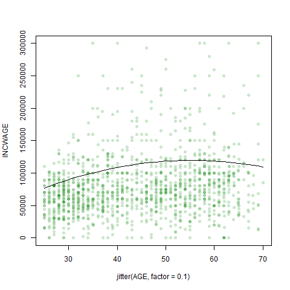

Homework 5
================
Patrick Sinclair, Kieran Yuen

For our subset, we decided to examine how different variables impact
wages for people who identify as female working in the various aspects
of the medical industry. We did this by creating an object that houses
different industry codes pertaining to the medical field, including
physician and dentist offices, hospitals, nursing facilities and other
health-care practitioners.

For our initial regression, we elected to use the
[INCWAGE](https://cps.ipums.org/cps-action/variables/INCWAGE#description_section)
observations as our measure of wage. We made this decision as we believe
it is reasonable to assume that most of the data observations in our
subset (females in the medical field with a Bachelor or Advanced degree)
would only hold one job. INCWAGE is ‘the total pre-tax and salary
income’ each of the respondent’s earned as an employee in the previous
12 months prior to the survey.

    ## 
    ## ==========================================================
    ##                              Dependent variable:          
    ##                     --------------------------------------
    ##                     INCWAGE ~ AGE + I(AGE2) + educ_college
    ## ----------------------------------------------------------
    ## AGE                              5,121.620***             
    ##                                   (987.179)               
    ##                                                           
    ## I(AGE2)                           -46.251***              
    ##                                    (10.823)               
    ##                                                           
    ## educ_college                    -35,171.720***            
    ##                                  (2,897.363)              
    ##                                                           
    ## Constant                         -22,289.850              
    ##                                  (21,349.910)             
    ##                                                           
    ## ----------------------------------------------------------
    ## Observations                        2,626                 
    ## R2                                  0.082                 
    ## Adjusted R2                         0.081                 
    ## Residual Std. Error         73,930.770 (df = 2622)        
    ## F Statistic                77.788*** (df = 3; 2622)       
    ## ==========================================================
    ## Note:                          *p<0.1; **p<0.05; ***p<0.01

The regressor coefficients from the initial regression all appear to be
statistically significant, the only exception being the intercept
coefficient. What is curious is that holding a Bachelor’s degree has a
*negative* correlation with wages within the subset, as does \(Age^2\).
However, for our observations this makes sense; we limited our
observations to people who hold Bachelor’s or Advanced degrees. From an
outsider’s perspective of the industry, those whole hold advanced
degrees or extra certifications within the medical field would be those
who have specialized in particular fields, commanding higher wages for
their specialized knowledge. A Bachelor’s degree is closer to an entry
level requirement in the field, so the comparative wages are
significantly lower.

From this regression, we created our prediction model using 50% of the
2626 observations in our subset in order to give the model a sizable
enough sample from which to draw its comparisons. For easy
visualization, the jitter has been set to 0.1, to demonstrate the trends
at different ages and the range of the INCWAGE axis has been capped at
300,000.

To draw some comparison from the linear regression, we set the
prediction model to predict wages for those with advanced degrees.

The plot for the predicted values shows us a gently sloped concave curve
that has a peak predicted value of

    ## [1] 119489.4

When we added high polynomials, \(Age^3\), \(Age^4\) and \(Age^5\), to
the regression, the absolute values of the corresponding coefficients
get progressively smaller.

    ## 
    ## ========================================================================================
    ##                                             Dependent variable:                         
    ##                     --------------------------------------------------------------------
    ##                     INCWAGE ~ AGE + I(AGE2) + I(AGE3) + I(AGE4) + I(AGE5) + educ_college
    ## ----------------------------------------------------------------------------------------
    ## AGE                                              6,701.787                              
    ##                                                (143,188.500)                            
    ##                                                                                         
    ## I(AGE2)                                           282.990                               
    ##                                                 (6,578.649)                             
    ##                                                                                         
    ## I(AGE3)                                           -16.410                               
    ##                                                  (147.274)                              
    ##                                                                                         
    ## I(AGE4)                                            0.276                                
    ##                                                   (1.609)                               
    ##                                                                                         
    ## I(AGE5)                                            -0.002                               
    ##                                                   (0.007)                               
    ##                                                                                         
    ## educ_college                                   -35,144.240***                           
    ##                                                 (2,909.189)                             
    ##                                                                                         
    ## Constant                                        -106,948.300                            
    ##                                               (1,213,726.000)                           
    ##                                                                                         
    ## ----------------------------------------------------------------------------------------
    ## Observations                                       2,626                                
    ## R2                                                 0.082                                
    ## Adjusted R2                                        0.080                                
    ## Residual Std. Error                        73,953.420 (df = 2619)                       
    ## F Statistic                               39.103*** (df = 6; 2619)                      
    ## ========================================================================================
    ## Note:                                                        *p<0.1; **p<0.05; ***p<0.01

When plotted, the curves follow a similar slope and shape. Adding the
extra polynomials increases the maximum predicted wage slightly to

    ## [1] 120590.2

but we notice a steepening of the “Polynomials” curve as age approaches
70. Running a joint hypothesis shows us that the higher-order polynomial
terms are not significant; i.e. they have next to relationship with how
wages are determined within the dataset.

    ## Linear hypothesis test
    ## 
    ## Hypothesis:
    ## I(AGE^3)  + I(AGE^4)  + I(AGE^5) = 0
    ## 
    ## Model 1: restricted model
    ## Model 2: INCWAGE ~ AGE + I(AGE^2) + I(AGE^3) + I(AGE^4) + I(AGE^5) + educ_college
    ## 
    ##   Res.Df        RSS Df Sum of Sq      F Pr(>F)
    ## 1   2620 1.4324e+13                           
    ## 2   2619 1.4324e+13  1  67104124 0.0123 0.9118

In both regression, wages as a function of age trend upwards. Wage peaks
at the age of 55 in the initial regression model but peaks later, at 59,
in the polynomial model. The range of predicted wages is larger in the
polynomial model by 4549.3295301

What if you used \(log(Age)\)? (And why would polynomials in
\(log(Age)\) be useless? Experiment.)

<!-- -->

    ## [1] 83344.81

Recall about how dummy variables work. If you added educ\_hs in a
regression using the subset given above, what would that do?
(Experiment, if you aren’t sure.) What is interpretation of coefficient
on *educ\_college* in that subset? What would happen if you put both
*educ\_college* and *educ\_advdeg* into a regression? Are your other
dummy variables in the regression working sensibly with your selection
criteria?

    ## 
    ## Call:
    ## lm(formula = (INCWAGE ~ AGE + I(AGE^2) + educ_college + educ_advdeg))
    ## 
    ## Coefficients:
    ##  (Intercept)           AGE      I(AGE^2)  educ_college   educ_advdeg  
    ##    -22289.85       5121.62        -46.25     -35171.72            NA

    ## 
    ## Call:
    ## lm(formula = (INCWAGE ~ AGE + I(AGE^2) + educ_advdeg + educ_college))
    ## 
    ## Coefficients:
    ##  (Intercept)           AGE      I(AGE^2)   educ_advdeg  educ_college  
    ##    -57461.57       5121.62        -46.25      35171.72            NA

Why don’t we use polynomial terms of dummy variables? Experiment.

What is the predicted wage, from your model, for a few relevant cases?
Do those seem reasonable?

What is difference in regression from using log wage as the dependent
variable? Compare the pattern of predicted values from the two models
(remember to take exp() of the predicted value, where the dependent is
log wage). Discuss.

    ##    AGE female educ_college educ_advdeg  yhatlog
    ## 1   25      1            1           1 38951.67
    ## 2   26      1            1           1 42671.68
    ## 3   27      1            1           1 46135.20
    ## 4   28      1            1           1 49360.89
    ## 5   29      1            1           1 52365.44
    ## 6   30      1            1           1 55163.84
    ## 7   31      1            1           1 57769.63
    ## 8   32      1            1           1 60195.04
    ## 9   33      1            1           1 62451.16
    ## 10  34      1            1           1 64548.10
    ## 11  35      1            1           1 66495.10
    ## 12  36      1            1           1 68300.61
    ## 13  37      1            1           1 69972.37
    ## 14  38      1            1           1 71517.53
    ## 15  39      1            1           1 72942.66
    ## 16  40      1            1           1 74253.84
    ## 17  41      1            1           1 75456.70
    ## 18  42      1            1           1 76556.46
    ## 19  43      1            1           1 77557.96
    ## 20  44      1            1           1 78465.74
    ## 21  45      1            1           1 79284.00
    ## 22  46      1            1           1 80016.68
    ## 23  47      1            1           1 80667.46
    ## 24  48      1            1           1 81239.78
    ## 25  49      1            1           1 81736.89
    ## 26  50      1            1           1 82161.82
    ## 27  51      1            1           1 82517.44
    ## 28  52      1            1           1 82806.42
    ## 29  53      1            1           1 83031.32
    ## 30  54      1            1           1 83194.53
    ## 31  55      1            1           1 83298.31
    ## 32  56      1            1           1 83344.81
    ## 33  57      1            1           1 83336.04
    ## 34  58      1            1           1 83273.95
    ## 35  59      1            1           1 83160.33
    ## 36  60      1            1           1 82996.94
    ## 37  61      1            1           1 82785.42
    ## 38  62      1            1           1 82527.32
    ## 39  63      1            1           1 82224.15
    ## 40  64      1            1           1 81877.31
    ## 41  65      1            1           1 81488.17
    ## 42  66      1            1           1 81058.02
    ## 43  67      1            1           1 80588.09
    ## 44  68      1            1           1 80079.56
    ## 45  69      1            1           1 79533.55
    ## 46  70      1            1           1 78951.15

    ## [1] 73658.94

    ## [1] 73658.94

Try some interactions, like this,

    ## 
    ## Call:
    ## lm(formula = INCWAGE ~ AGE + I(AGE^2) + educ_college + I(educ_college * 
    ##     AGE) + I(educ_college * (AGE^2)))
    ## 
    ## Coefficients:
    ##               (Intercept)                        AGE  
    ##                 -98495.49                    8058.95  
    ##                  I(AGE^2)               educ_college  
    ##                    -71.89                   92301.75  
    ##     I(educ_college * AGE)  I(educ_college * (AGE^2))  
    ##                  -4863.83                      41.81

    ## 
    ## Call:
    ## lm(formula = INCWAGE ~ AGE + I(AGE^2) + educ_college + I(educ_college * 
    ##     AGE) + educ_advdeg + I(educ_advdeg * AGE))
    ## 
    ## Coefficients:
    ##           (Intercept)                    AGE               I(AGE^2)  
    ##             -54253.84                5971.18                 -49.01  
    ##          educ_college  I(educ_college * AGE)            educ_advdeg  
    ##              12721.32               -1071.56                     NA  
    ##  I(educ_advdeg * AGE)  
    ##                    NA

and explain those outputs (different peaks for different groups).

What are the other variables you are using in your regression? Do they
have the expected signs and patterns of significance? Explain if there
is a plausible causal link from X variables to Y and not the reverse.
Explain your results, giving details about the estimation, some
predicted values, and providing any relevant graphics. Impress.

Our Regression Model: Departure Time and Health Insurance

### Bibliography

<https://cps.ipums.org/cps-action/variables/INCWAGE#description_section>
